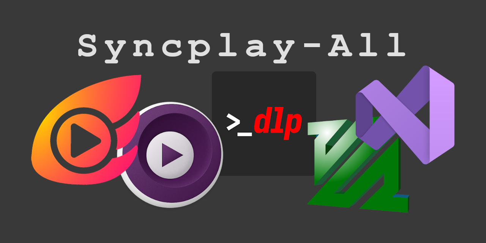

# Syncplay All

  
"Syncplay-All for Windows" es un proyecto para hacer accesible a una masa no capacitada en el ámbito informático el programa Syncplay junto a todas sus dependencias, como vc-redist, mpv, yt-dlp y ffmpeg.
Syncplay sirve para sincronizar multimedia como películas o canciones en una sala virtual. Más información, abajo.
  
**ATENCIÓN**: No soy el creador de los programas aquí presentados. Este repositorio es solo un script para descargar e instalar dichos programas; lo único que hago es agruparlos en un ejecutable ya preconfigurado por mí para aquellxs usuarixs que no sepan cómo instalar cada aplicativo. Se insta a descargarlos e instalarlos desde sus repositorios originales.

**Se recomienda leer todo antes de ejecutar el programa y/o de abrir un issue.**

## Instalar

Simplemente vaya a [releases](https://github.com/canqiro/Syncplay-All/releases) y descargue el ejecutable (.exe). Ejecute el archivo y se le pedirá derechos de administrador el cual tiene que aceptar. Automáticamente se abrirá una consola de comandos. Dejar que termine el proceso que tiene que hacer y seguir los pocos pasos respectivos en caso de existir (si tiene que elegir números, hágalo desde el teclado alfanumérico; si no lo hace, puede que tenga que reiniciar el instalador). Esto último puede variar en existir o no dependiendo de la versión. Es necesaria una conexión a internet porque el instalador tiene que descargar los archivos respectivos.

**¡Todo listo!**

## Cómo funciona

Se recomienda mucho ver los propios repositorios para más información de los mismos.

Microsoft Visual C++ Redistributable Version, Syncplay, mpv, yt-dlp y ffmepg están en sus respectivos repositorios. El instaldor es un archivo autoextraíble que se extrae directamente en Program Files, creando una carpeta llamada “mpv” (`C:\Program Files\mpv\`).

Dentro de ella se encuentran el instalador (`updater.ps1`) que usará CMD para descargar e instalar todos los archivos correspondientes más actuales desde sus respectivos repositorios.

- [**Syncplay**](https://syncplay.pl/) es el programa principal para sincronizar la multimedia.
- [**Vc-redist**](https://learn.microsoft.com/es-es/cpp/windows/latest-supported-vc-redist?view=msvc-170) (Microsoft Visual C++ Redistributable Version) está por compatibilidad con Syncplay ya que en unos equipos parece no funcionar si no lo tienen instalado.
- [**mpv**](https://mpv.io/) es el reproductor recomendado y mejor compatible con Syncplay.
- [**yt-dlp**](https://github.com/yt-dlp/yt-dlp) es un programa para descargar videos de distintas plataformas; mpv lo necesita para reproducir videos en línea con los que Syncplay también es compatible.
- [**ffmepg**](https://www.ffmpeg.org/) lo necesita yt-dlp para poder manejar los archivos que tiene que reproducir.

Una vez extraído se inicia el archivo “updater.bat” que se encuentra dentro de la carpeta de mpv que busca y descarga el reproductor mpv a su versión más reciente junto con ffmpeg, y yt-dlp. Descargar la versión portable más reciente de Syncplay y la extrae en (`C:\Program Files\Syncplay\`).
Instala vc_redist en su versión de 32 bits, la instala y elimina el instalador.
Se descarga 7zip en caso de ser necesario, ya que necesita extraer los archivos comprimidos. [7zip](https://7-zip.org/) es un programa parecido a Winrar que permite comprimir y descomprimir archivos, es de código abierto y usable mediante consola de comandos.
Cuando ya acabó, de descargar e instalar todo lo necesario, aparecerá un mensaje en la consola imprimiendo que ha finalizado, y abre Syncplay, en muestra de que ya puede usarse.

Se recomienda ejecutar “updater.bat” al menos una vez al mes para mantener la compatibilidad. Este ya se encuentra directamente en el menú de inicio como “actualizar mpv” así que solo tiene que hacer clic en el mismo (pedirá privilegios de administrador) y esperar a que actualice todo. Se debería cerrar la ventana de CMD automáticamente.

A partir de aquí ya no me hago responsable. Igualmente, en caso de no abrirse Syncplay, puede reportar el error en este mismo proyecto y yo veré si es problema del ejecutable o del propio Syncplay; si es de Syncplay yo no puedo hacer nada y tendrá que referirse al propio repositorio de Syncplay.

## Opciones de configuración

En teoría, debería abrirse la ventana principal de Syncplay ya completamente configurada así que no es necesario realizar cambios. Lo único que habría que poner es el nombre de la sala, que puede ser el que el usuario elija, por eso no está predefinido. Las configuraciones seteadas pueden cambiarse a gusto del/la usuario/a. Se presentan ahora las configuraciones seteadas que vienen por defecto:

- Dirección del servidor: `syncplay.pl:8996`
- Ruta al reproductor: `C:\Program Files\mpv\mpv.exe` (esto tiene que dejarse tal como está a menos que quiera cambiar de ruta a mpv o cambiar el reproductor; esto último no es recomendable).
- Es necesario especificar un nombre de sala para poder empezar a sincronizar.
- Se añadió a icedrive.io como dominio de confianza ya que esta nube ofrece la posibilidad de disponer de un enlace directo a algún video subido a sus servidores. El link se lo tiene que extraer del propio HTML.
- La información del nombre y tamaño del archivo se estableció como “enviar”. Puede cambiarlo si gusta.
- Directorios para buscar medios: `C:\Stream\` (Solo cambiarlo si quiere poner alguna otra dirección o añadir otra. No puede estar vacío). Dicha carpeta fue creada al momento de la instalación.

Revisar el [manual de usuario de Syncplay](https://syncplay.pl/guide/) para más información.

### También:

Dentro de la carpeta “mpv” se encuentra un archivo llamado “yt-dlp.conf”. Este será usado por `yt-dlp.exe` para que mpv pueda reproducir los videos en línea y en él se especifican las configuraciones que debe usar. Solo configuré la resolución máxima de los videos (si está disponible). Abrir con un editor de texto y reemplazar “1080” por la resolución deseada. Visitar las [opciones de yt-dlp](https://github.com/yt-dlp/yt-dlp#usage-and-options) para más información.

Dentro de la carpeta “mpv” existe una carpeta llamada “mpv”. En ella hay un archivo “mpv.conf”; se establecieron los diferentes parámetros: `profile=fast; hwdec=auto-safe`. Pueden borrarse o cambiarse. Visitar las [configuraciones de mpv](https://mpv.io/manual/master/) para más información.

Estas 2 configuraciones por defectos están destinadas a equipos de gama baja o de una antigüedad considerable. Pueden modificarse o eliminarse para dejar las configuraciones por defecto.

## Consideraciones

Este repositorio es solo una muestra de los archivos que contiene cada ejecutable. No está hecho para compilarse. Por ende, repito, no están hechos para compilarse ni hay código fuente. Si se quiere ir al código fuente debe dirigirse a los repositorios originales cuyos links se especifican más arriba.

Fuera de eso, no hay diferencias con respecto a las versiones ejecutables que pueden encontrarse en releases. Syncplay solo tiene una versión por lo que se deduce que es universal; es la misma tanto para 32 bits como para 64 bits.

## Descargo de responsabilidad

Lo único que yo he hecho es agarrar los instaladores/ejecutables finales de los programas Microsoft Visual C++ Redistributable Version, Syncplay, mpv, yt-dlp y ffmepg y unirlos todos en un solo instalador. Yo solo me hago cargo de lo que sucede desde que inicia el ejecutable hasta que abre Syncplay lo que suceda después o antes de eso no es contemplado por el propio ejecutable.

En caso de tener problemas en ese período contactarme. Fuera de eso, contactar con los propios desarrolladores de los respectivos programas cuyos enlaces están más arriba.

Con todo puede extraer los ejecutables con WinRar, 7zip o con algún otro archivador de ficheros y revisar usted mismo que no contiene ningún archivo que no tengan los programas originales salvo los ya mencionados más arriba y que no contiene ningún tipo de malware.

Muchos, muchos de verdad, muchos agradecimientos a los mantenedores de Microsoft Visual C++ Redistributable Version, Syncplay, mpv, yt-dlp y ffmepg por seguir con estos proyectos realmente extraordinarios. Pueden apoyar los proyectos ya sea mejorándolos o de forma monetaria. Links en los respectivos repositorios.

Este proyecto es sin ánimos de lucro.
